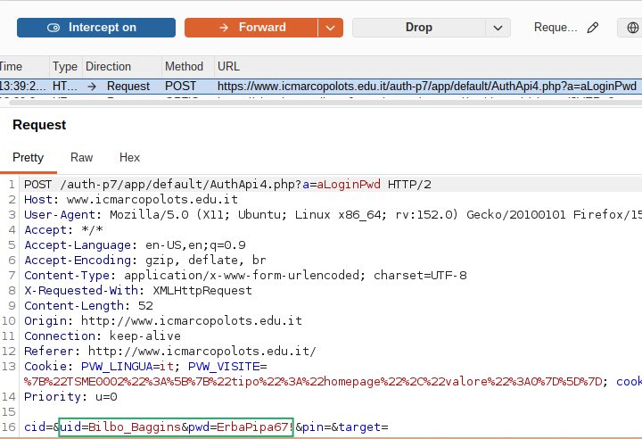
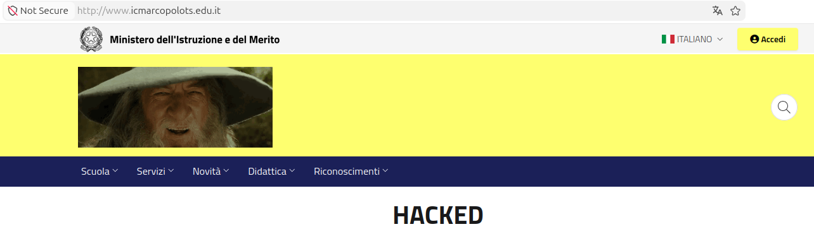
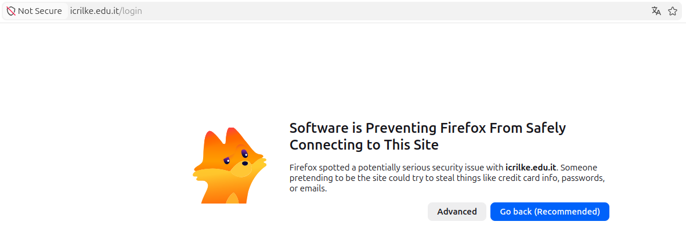
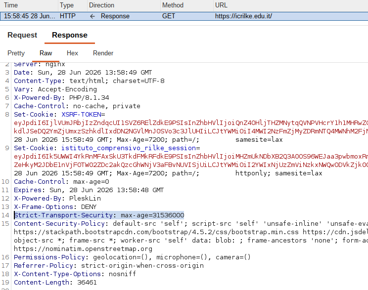

# AiM Lab 1
In this lab activity, a Man-in-the-Middle (MitM) / SSL Stripping attack will be performed using Burp Suite as a proxy. The proxy will intercept the browser's traffic to a website that does not implement the HSTS security protocol, downgrading the connection from HTTPS to HTTP. As a result, the victim will communicate with the proxy over an unencrypted connection, while the proxy maintains a secure connection with the real server.
## Case A

### 1. Choose a website that does not support HSTS:
www.icmarcopolots.edu.it was choosen.

results of curl -I `http://www.icmarcopolots.edu.it`:

```bash
HTTP/1.1 301 Moved Permanently   # Redirected to https://...
Server: nginx/1.26.1
Date: Sun, 28 Jun 2026 11:13:29 GMT
Content-Type: text/html
Content-Length: 169
Connection: keep-alive
Location: https://www.icmarcopolots.edu.it/
```
results of curl -I `https://www.icmarcopolots.edu.it`:

```bash
HTTP/2 200 
server: nginx/1.26.1
date: Sun, 28 Jun 2026 11:19:43 GMT
content-type: text/html; charset=UTF-8
vary: Accept-Encoding
vary: Accept-Encoding
x-frame-options: SAMEORIGIN;
pragma: public
cache-control: public, must-revalidate, proxy-revalidate
```
### 2. Point your browser to <b>http</b>://www.icmarcopolots.edu.it:
Despite the remote server's configuration to permanently redirect all traffic to HTTPS (via a 301 Moved Permanently status code), the victim's browser remains on the unencrypted HTTP connection. The address bar explicitly displays a "Not Secure" warning.


Burp establishes the secure TLS connection with the real server itself, downgrades the content received, and serves it back to the browser in plain text HTTP.
### 3. Try to apply changes to requests/responses

#### 1. Reading credential in plain text:



#### 2. Modify the web page:
With match and replace Burp feature the webpage was modified:
- Expected aspect:


- Modifyed aspect:



## Case B

### 1. Choose a website that uses hsts:
icrilke.edu.it was choosen:
results of curl -I `http://icrilke.edu.it`:

```bash
HTTP/1.1 301 Moved Permanently
Server: nginx
Date: Sun, 28 Jun 2026 12:01:18 GMT
Content-Type: text/html
Content-Length: 162
Connection: keep-alive
Location: https://icrilke.edu.it/


```
results of curl -I `https://icrilke.edu.it`:

```bash
HTTP/2 200 
server: nginx
date: Sun, 28 Jun 2026 12:01:40 GMT
content-type: text/html; charset=UTF-8
...
strict-transport-security: max-age=31536000 #### HSTS header
...
```
### 2. Point browser to <b>http</b>://icrilke.edu.it
In this case the attack is not successfull since the browser blocks the traffic



### 3. Delete website from HSTS
Using Chrome it was possible to delete the HSTS set entry for the website, and with the Burp proxy it was possible to delete the STS headers and to perform the attack.



Adding the website back to the HSTS set the request blocked by the browser